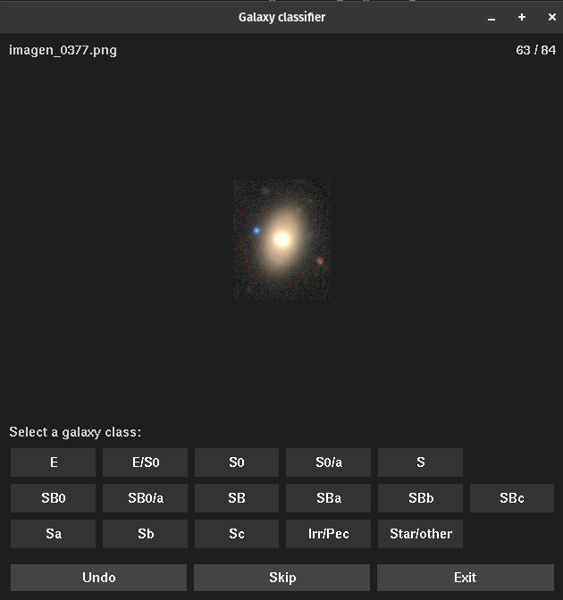

.. contents::
   :depth: 3
..

=============

.. image:: https://zenodo.org/badge/130286946.svg
   :target: https://zenodo.org/badge/latestdoi/130286946

.. image:: https://img.shields.io/pypi/v/CluSex.svg
    :alt: PyPI-Server
    :target: https://pypi.org/project/CluSex/

.. image:: https://img.shields.io/badge/-PyScaffold-005CA0?logo=pyscaffold
    :alt: Project generated with PyScaffold
    :target: https://pyscaffold.org/

.. image:: https://www.repostatus.org/badges/latest/active.svg
   :alt: Project Status: Active – The project has reached a stable, usable state and is being actively developed.
   :target: https://www.repostatus.org/#active

**CluSex**
===========

What is CluSex?
-------------------

CluSex is a set of routines that assists Sextractor 
to perform on images of cluster galaxies (or high 
density of objects).  

Particularly, it joins two (or more)  `sextractor`_ catalogs,
creates masks, finds saturated star regions, computes 
sky background and makes stamps for every detected object. 

.. _sextractor: https://www.astromatic.net/software/sextractor/

--------------

Why CluSex?
--------------

It is hard to find a satisfactory Sextractor configuration to 
detect all the objects in the image (see Haussler 2007). For instance, 
a Sextractor parameter configuration can be optimized to detect large galaxies, 
but it might be unable to detect small dim galaxies, and vice versa. 
In addition, Sextractor overestimates the size of low surface brightness 
galaxies inside regions of high density of objets. To see those 
effects check the image below for a run of Sextractor in 
an Abell cluster: 

In the previous image, red ellipses are galaxies where their 
size are clearly overestimated. A different parameter configuration 
produce a different result, for instance, the figure below 
shows a different configuration for the same galaxy cluster image:

.. image:: img/Comarun2.png

For the above figure, galaxy sizes are better estimated but Sextractor 
is unable to detect (or deblend) all the galaxies.

The same cluster image can be improved after using CluSex. To
see this check the image below:

.. image:: img/Comagood.png

It shows an improved deteccion and size estimation of the objects
for the same Abell Cluster. This result can be improved adding
different Sextractor configuration runs. For instance, the figure 
below is show an even better catalog using joincat 
command to detect the small dim objects in the image.

In addition, CluSex improves computation of sky 
background, creation of masks, and estimation of 
the area of saturated stars. 

Below is shown an estimation of the size of a region 
across a bright saturated star:

--------------

Installation
---------------

Install sextractor (if you haven't done so)

For linux:
::

   sudo apt install sextractor

Install `Ds9`_ (if you haven't done so) 

.. _Ds9: https://sites.google.com/cfa.harvard.edu/saoimageds9/download

Download it and make a symbolic link to the /usr/local/bin or
make an alias. 

::
    
    sudo ln -s /path/to/ds9 /usr/local/bin 

Once that is done, install it using pip:

::

    pip install CluSex

another option is to download the code and run

::

   pip install . 

--------------

USAGE
------

Quickstart
~~~~~~~~~~~~~

To run the code just type in the command line:

::

   clusex ConfigFile 

Where ConfigFile is the configuration parameter filename for CluSex

Example of Configuration file
~~~~~~~~~~~~~~~~~~~~~~~~~~~~~~~

below it is shown an example of a CluSex configuration 
file (it follows the format of configparser library):

::

    [General]
    image = A671.fits
    MAG_ZEROPOINT =  29.17    
    GAIN        =    5.6     
    PIXEL_SCALE =    0.68   
    SEEING_FWHM =    1.5   

    MakeMask = False 
    OutCatalog =  hotcold.cat
    RegDs9 =   hotcold.reg

    run1 = True 
    run2 = True

    [Run1]
    DEBLEND_NTHRESH1 = 64 
    DEBLEND_MINCONT1 = 0.01 

    ANALYSIS_THRESH1 = 10  
    DETECT_THRESH1   = 10 
    DETECT_MINAREA1  = 10

    BACK_SIZE1     = 100
    BACK_FILTERSIZE1  = 11

    [Run2]
    DEBLEND_NTHRESH2 = 16
    DEBLEND_MINCONT2 = .1 

    ANALYSIS_THRESH2 = 1.2 
    DETECT_THRESH2  = 1.2 
    DETECT_MINAREA2 = 10 

    BACK_SIZE2      = 10
    BACK_FILTERSIZE2 = 2

    [Sizes]

    Scale =  1.5 
    Offset = 0
    ReduCoef = 0.2
    FracTol = 0.5
    JoinScale = 1.5 
    ScaleCor = 1.5 

    [Saturation]

    SATUR_LEVEL =    30000 
    SatDs9 = sat.reg
    SatScale = 1.7
    SatOffset =  20
    MinSatSize  = 20     
    SatQ = 0.7
    SatMethod =  3 

Some of the configuration parameters are the same 
for Sextractor and corresponds to each of the runs (hot
and cold runs). To check the explanation of each 
parameter see the section below:

Configuration parameters 
~~~~~~~~~~~~~~~~~~~~~~~~~~~

Check the link below for an explanation of the config file:

`configuration <docs/config.rst>`__

Tip
~~~~~~~~

To make CluSex works properly, the first run must be configurated with a
low deblend number and high SNR, and, on the other hand, the second run
with a high deblend number and low SNR (check sextractor manual for details 
to how to do this).

Galaxy Classification
~~~~~~~~~~~~~~~~~~~~~~~
Once a catalog was obtained with ``clusex``, use ``getDesi`` to
download png images of `DESI`_ to classify galaxies using the gui ``guiclass`` 
command:

.. _DESI: https://www.legacysurvey.org/viewer

or use ``classify`` command to classify the downloaded galaxy images using the chatGPT API. (you
need a openai API key and must buy tokens from openai `platform`_) 

.. _platform: https://platform.openai.com/docs/overview

--------------

How it works
--------------

In order to solve these problems, CluSex runs 
Sextractor twice with different configuration 
parameters: the first run detects large bright  
saturated galaxies and the second run detects 
small dim galaxies. This has been done before 
check Haussler (2007). 

CluSex adds all the detected objects in the 
first Sextractor run. Next, it adds the objects 
of the second Sextractor run only if their center 
is outside of the ellipse of any the objects of 
the first run.

The combination of the two catalogs gives a 
better representation for almost all the objects 
of the image. In addition, it also estimates 
the area of saturated stars in the image. 

Furthermore, to estimate the true size of low surface 
brightness objects, CluSex compares the sizes 
of the same object in each of the two catalogs and
keeps the smaller one. On the other hand, 
if the object was detected only for one catalog, 
it is reduced by a constant factor given 
in the CluSex parameter file.

Masks
~~~~~~

Check images given by Sextractor can be used 
for masks, but this is a bad practice specially
if Sextractor have wrongly computed the 
background. In contrast, CluSex creates
masks using the data given by Sextractor catalog. 
Every object is represented by an ellipse mask 
which it can be enlarged (or shortened) by the user.
To see an example of a mask which includes the 
saturated stars, check the 
image below. 

.. image:: img/mask.png

Every ellipse object mask is filled with the same
number catalog that it is given by the CluSex catalog (same
as Sextractor). Hence, an object ellipse mask can be easily 
removed just by simply eliminating the pixel values that
coincide with their Sextractor number catalog. For instance,
for the figure below the large ellipse in the center has been 
removed using the short routine remellmask:

.. image:: img/mask2.png

Sky Background
~~~~~~~~~~~~~~~~

Sky background can be done poorly if objects's sizes are wrongly 
estimated or not detected at all. Also it is known 
that Sextractor overestimates the sky background (Haussler 2007). 
A wrong sky background value will produce a bad computation 
of Sersic index for model fitting.

CluSex uses two different methods through *compsky* command to 
compute the sky background: 1) gradient sky
and 2) random boxes around the objects.

Gradient sky method computes the background sky in a ring around 
the object. To locate this ring, Clusex creates 
concentric rings around the object and computes the 
background in every ring. This will create a set of sky values 
for each ring. The gradient is computed for this set. When 
the gradient of ring sky values turns positive,
clusex stops and measure the sky in that ring. A similar approach 
has been used in Haussler 2007. 

On the other hand, for the random box method, 
clusex creates boxes of the same size located 
at random positions around the object. After a 
given number of boxes, clusex computes the 
sky background. 

--------------

Additional features 
---------------------

CluSex contains other routines to improve Sextractor photometry. They
include: combination of two catalogs, creation of masks,
creation of Ds9 region file, and computation of sky background.

Except for sex2ds9 routine, the use of the routines is suggested 
in the following order: CluSex, Joincat (if needed), makemask, and
compsky. Those routines are separated because the user need to be verify 
that the output is well done before continuing  with the next routine.

Joincat 
~~~~~~~~~

Joincat is a small CluSex version. It just joins two 
existent sextractor catalogs. The aim is that a third Sextractor 
catalog can be merged with the output of CluSex. Therefore, this
hopefully will detect those objects that were unable to be detected 
by CluSex. 

The principle is the same as CluSex: objects of the second catalog
will be added to the first one only if their center is outside the 
ellipse of the objects of the first catalog. Use it only if it is 
necessary. An additional option (-i) will add all the objects where
the object position is not in the other catalog.

MakeMask
~~~~~~~~~

This routine creates an image which contains ellipse masks for every object. 
It needs the CluSex output catalog and saturated ds9 regions (created by
CluSex as well)

Sky background
~~~~~~~~~~~~~~~~

This routine use two methods (gradient sky and random box) to compute
sky background for every detected object by CluSex. Output catalog
is the same as the input catalog but with the background column changed
to the new values

sex2ds9
~~~~~~~~~

Creates a ds9 region file from the sextractor output catalog

remellmask
~~~~~~~~~~~~~

This is a short routine that removes ellipse masks from
the mask. Useful when a model fitting will be applied
to the galaxy. 

--------------

HOW TO
-------

Full explanations of the commands above are found in

`How to run <docs/howto.rst>`__

--------------

NOTES
------
CluSex was designed to provide 
an improved sextractor catalog to my other project (DGCG). 
Hence, for the current CluSex version, it only works 
for the 14 output sextractor columns below::

  NUMBER

  ALPHA_J2000
  DELTA_J2000

  XPEAK_IMAGE
  YPEAK_IMAGE

  MAG_BEST

  KRON_RADIUS

  FLUX_RADIUS

  ISOAREA_IMAGE

  A_IMAGE

  ELLIPTICITY

  THETA_IMAGE

  BACKGROUND

  CLASS_STAR

  FLAGS

Details of these output parameters can be found in
the Sextractor manual. Obviously some of the output parameters
can be changed to the other options of Sextractor like MAG_BEST can
be changed to MAG_AUTO and so.

Additional columns will be added in future releases.

--------------

API
----

API:

`API <docs/api.rst>`__

--------------

Cite as
-----------

If you find this code useful, please cite as:

Añorve, C., Gutiérrez, O., & López-Cruz, O. (2024). 
canorve/CluSex: CluSex v2.4.2 (v2.4.2). Zenodo. https://doi.org/10.5281/zenodo.14027745

--------------

Questions?
--------------

Code is far from perfect, so if you have suggestions or questions
Please send an email to canorve [at] gmail [dot] com

--------------

License
---------

This code is under the license of **GNU**

