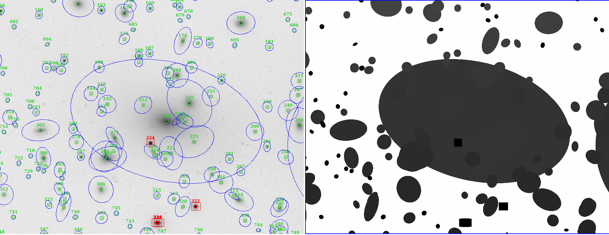

.. contents::
   :depth: 3
..

CluSex
========

**Documentation under construction**

What is CluSex?
--------------

CluSex is a set of routines that aids Sextractor 
to perform on images of cluster galaxies (or high 
density of objects).  

More specifically, it joins two `sextractor`_ catalogs,
creates masks, finds saturated regions and computes 
sky background. 

.. _sextractor: https://www.astromatic.net/software/sextractor/

Why CluSex?
------------

It is hard to find an effective Sextractor configuration for
all the objects in the image (check Haussler 2007). For example, 
a sextractor configuration can be optimized to detect large galaxies, 
but it might be unable to detect small dim galaxies, and vice versa. 
In addition, Sextractor overestimates the size of low surface brightness 
galaxies inside regions of high density of objets. To see those 
effects check the image below: 

.. image:: img/Comarun1.png

Sextractor run for an Abell Cluster. Red ellipses 
are galaxies where their size are clearly overestimated. 

Different Sextractor configuration for the same Abell Cluster. Galaxy sizes
are better estimated but it is unable to detect (or deblend) all the galaxies.

The same cluster is shown below improved after using CluSex:

An improved deteccion and size estimation of the objects
for the same Abell Cluster using CluSex 

Below is show an even better catalog using joincat command to 
detect the small dim objects in the image.

.. image:: img/Comaimproved.png

In addition, CluSex improves computation of sky 
background, creation of masks, and estimation of 
the area of saturated stars. 

Below is shown an estimation of the size of a  region 
across a bright saturated star:

.. image:: img/SatRegion.png

How it works
~~~~~~~~~~

In order to solve these problems, CluSex runs 
Sextractor twice with different configuration 
parameters: the first run detects large bright  
saturated galaxies and the second run detects 
small dim galaxies. 

Clusex adds all the objects detected in the 
first Sextractor run. Next, it adds the objects 
of the second Sextractor run if they meet the 
following condition: For each object, their center 
must not be inside the ellipse of the objects of 
the first run.

The combination of the two catalogs gives a 
better representation of all objects of the 
image. It also estimates the area of saturated 
stars in the image. 

Furthermore, to estimate the true size of low surface 
brightness objects, CluSex compares the sizes 
of the detected object in each of the two catalogs.
If the object was detected only for one catalog, 
it is reduced by a constant factor introduced 
by the user.

Check images given by Sextractor can be used 
for masks, but this is a bad practice specially
if Sextractor have wrongly computed the background.
In contrast, CluSex creates
masks using the data given by sextractor catalog. Every object
is represented by a ellipse masks which it can  
be enlarged (or shortened) by the user.
To see the masks included the saturated stars, check the 
image below. 

Every ellipse object mask is filled with the same
number that it is given in the CluSex catalog. Hence
any ellipse mask can be easily removed just removing
all the pixels that have the same value in counts as 
its Sextractor number catalog. For instance, the 
large ellipse in the center has been removed using
the short routine remellmask:

Sky background can be done poorly if objects's sizes are wrongly 
estimated or not detected at all. Also it is known (Haussler 2007)
that Sextractor overestimates the sky background. 
A wrong sky background value will produce a bad estimation 
of the Sersic index of the galaxy for fitting surface brightness models.

CluSex uses two different methods to compute 
sky background: 1) gradient sky
and 2) random boxes around the objects.

Gradient sky method computes the background sky in a ring around 
the object. To locate this ring, Clusex creates 
concentring rings around the object and computes the 
background in every ring. This will create a set of sky values 
for each ring. The gradient is computed for this set. When 
the gradient of ring sky values turns positive,
clusex stops and measure the sky in that ring. A similar approach 
has been used in Haussler 2007. 

On the other hand, for the random box method, 
clusex creates boxes of the same size located 
at random positions around the object. After a 
given number of boxes, clusex computes the 
sky background. 

Requirements
------------

- astropy
- numpy

Installation
------------

Install sextractor (if you haven't done yet)

For linux:
::

   sudo apt install sextractor

Install `Ds9`_ (if you haven't done yet) 

.. _Ds9: https://sites.google.com/cfa.harvard.edu/saoimageds9/download

Download it and make a symbolic link to the /usr/local/bin or
make an alias. 

::
    
    sudo ln -s /path/to/ds9 /usr/local/bin 

Once that is done, download the code and run

::

   pip install . 

or 

::

   pip install clusex 

Quickstart
----------

To run the code just type in the command line:

::

   clusex ConfigFile 

Where ConfigFile is the configuration parameters filename for pysex

Example of Configuration filename
~~~~~~~~~~~~~~~~~~~~~~~~~~~~~~~~~

# params for first run of Sextractor # run with low deblend number and
high SNR

FirstRun 1 # Enable first run (1 = run)

ANALYSIS_THRESH1 20 # or , in mag.arcsec-2

DETECT_THRESH1 20 # or , in mag.arcsec-2

DETECT_MINAREA1 10 # minimum number of pixels above threshold

DEBLEND_NTHRESH1 64 # Number of deblending sub-thresholds

DEBLEND_MINCONT1 0.001 # Minimum contrast parameter for deblending

BACK_SIZE1 100

BACK_FILTERSIZE1 11

# params for second run of Sextractor # run with high deblend number and
low SNR

SecondRun 1 # enable second run (1 = run)

ANALYSIS_THRESH2 1.5 # or , in mag.arcsec-2

DETECT_THRESH2 1.5 # or , in mag.arcsec-2

DETECT_MINAREA2 10 # minimum number of pixels above threshold

DEBLEND_NTHRESH2 16 # Number of deblending sub-thresholds

DEBLEND_MINCONT2 0.01 # Minimum contrast parapymeter for deblending

BACK_SIZE2 10

BACK_FILTERSIZE2 2

# General parameters:

Scale 1 # factor scale which ellipses are enlarged

SatDs9 sat.reg

SatScale 3

SatOffset 1

MakeMask 0

OutCatalog hotcold.cat

RegDs9 hotcold.reg

Check here for an explanation of every parameter of the config file 

`configuration <docs/config.rst>`__

Suggestion
~~~~~~~~~~

To make CluSex works properly, the first run must be configurated with a
low deblend number and high SNR, and, on the other hand, the second run
with a high deblend number and low SNR (check sextractor manual for details 
to how to do this).

Additional features 
-------------------

CluSex contains other routines to improve Sextractor photometry. They
include: simple combination of merge two catalogs, creation of masks,
convertion to ds9 reg file, and sky background computation. 

Except for sex2ds9 routine, the use of the routines is suggested 
in the following order: CluSex, Joincat (if needed), makemask, and
compsky. Those routines are separated because the user need to be verify 
that the output is well done before to continue with the next routine.

Joincat 
~~~~~~~

Joincat is a small CluSex version. It just joins two 
existent sextractor catalogs. The aim is that a sextractor 
catalog can be merged with the output of CluSex. The aim is to 
detect those objects that were unable to be detected 
by CluSex. 

The principle is the same as CluSex: objects of the second catalog
will be added to the first one only if their center is outside the 
ellipse of the objects of the first catalog. Use it only if it is necessary. 

MakeMask
~~~~~~~

This routine creates an image containing ellipse masks for every object. 
It needs the CluSex output catalog and saturated ds9 regions (created by
CluSex as well)

Sky background
~~~~~~~~~~~~~~

This routine use two methods (gradient sky and random box) to compute
sky background for every detected object by CluSex. Output catalog
is the same as the input catalog but with the background column changed
to the new values

sex2ds9
~~~~~~~

Creates a ds9 region file from the sextractor output catalog

Full explanations of the commands above are found in

To see how to run those commands see:

`How to run <docs/howto.rst>`__

NOTES
----
CluSex was designed to provide 
an improved sextractor catalog to my other project (DGCG). 
Consequently for the current CluSex version, it only works 
for the 14 output sextractor columns below:

NUMBER

ALPHA_J2000
DELTA_J2000

XPEAK_IMAGE
YPEAK_IMAGE

MAG_BEST

KRON_RADIUS

FLUX_RADIUS

ISOAREA_IMAGE
A_IMAGE
ELLIPTICITY

THETA_IMAGE

BACKGROUND

CLASS_STAR

FLAGS

Details of these output parameters can be found in
the Sextractor manual 

Additional columns will be added in future releases.

API
----

API:

`API <docs/api.rst>`__

Questions?
~~~~~~~~~~

Code is far from perfect, so if you have suggestions or questions
Please send an email to canorve [at] gmail [dot] com

License
-------

This code is under the license of **GNU**
